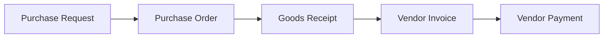
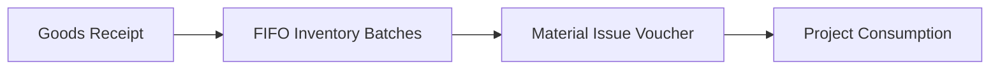
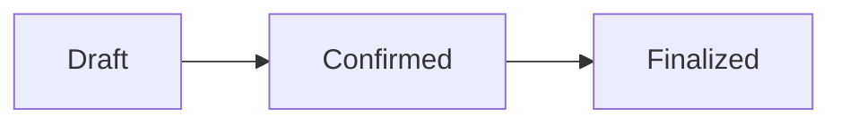
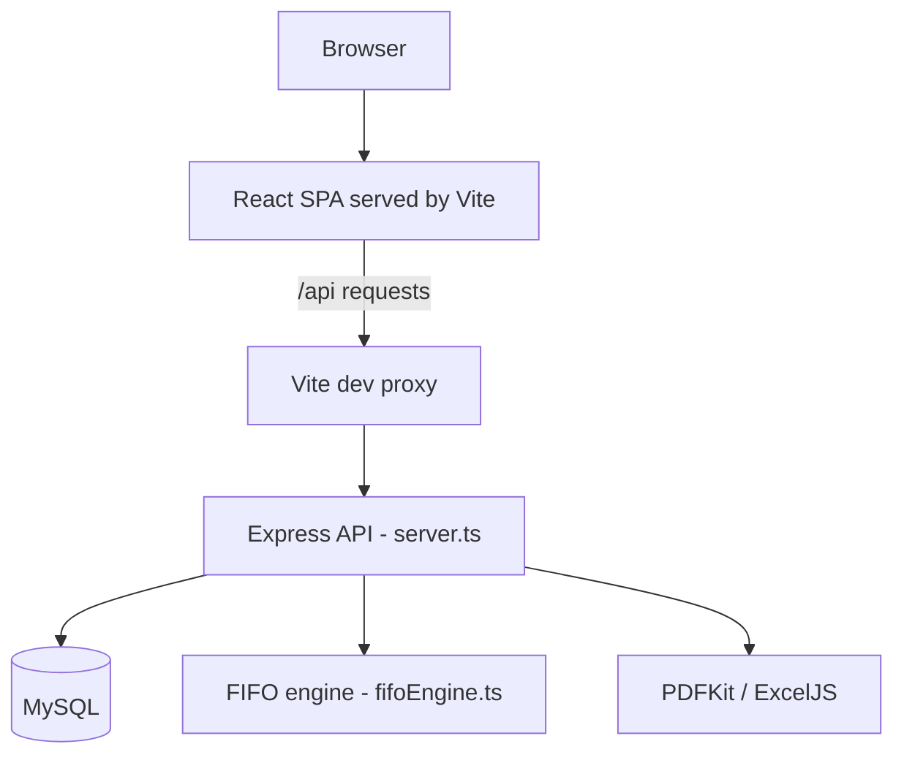

# BuildCore CMS

**Construction Office Management & ERP Platform**

BuildCore CMS is an internal business management system for construction and infrastructure operations. It covers the full procurement-to-payment cycle, FIFO-based inventory control, project consumption tracking, and role-based operational governance, backed by a MySQL database and a Node.js/Express API.

The application identifies itself as **BuildCore CMS | SIPL**.

---

## Overview

Construction businesses lose money in the gaps between documents: a purchase order that no longer matches the material actually received, stock issued to a site without a traceable cost, a vendor invoice paid twice because nobody linked it back to the goods receipt.

BuildCore CMS closes those gaps by keeping every stage of the material and money lifecycle in one connected chain. A purchase request becomes a purchase order, the order is received against a GRN, the GRN feeds FIFO-valued inventory batches, material is issued to projects through vouchers that snapshot their own cost, and the vendor invoice is raised against the very GRNs it is meant to cover — with payments allocated back against those invoices.

Every stage is permission-controlled, auditable, and exportable as a PDF or Excel document.

---

## Key Capabilities

- **End-to-end procurement lifecycle** — purchase requests, approvals, purchase orders with revision history, goods receipts, vendor invoices, and vendor payments.
- **FIFO inventory valuation** — stock is held as dated batch layers and consumed oldest-first, with confirmed-rate precedence once a vendor invoice is finalized.
- **Cost-snapshotted material issue** — each Material Issue Voucher line records the exact batches and costs it consumed, so historical project costs stay stable.
- **Reversible material issues** — item-level and voucher-level reverts restore batch quantities and value inside a single database transaction.
- **Opening stock management (UOS)** — add, review, and edit opening stock layers with guarded edit rules.
- **Vendor invoice reconciliation** — invoices are linked to specific GRNs, with variance tracking between the reference GRN amount and the invoice amount.
- **Payment allocation** — a single vendor payment can be allocated across multiple vendor invoices.
- **Role-based access control** — a database-backed permission matrix with per-user overrides, editable at runtime.
- **Document generation** — server-side PDF generation and Excel export for business documents and ERP reports.
- **Activity audit trail** — ERP actions are logged with actor, module, entity, and change details.

---

## Modules

| # | Module | Description |
|---|---|---|
| 1 | **Dashboard** | Aggregate operational summary across the system. |
| 2 | **Security Settings** | CEO-only screen for editing the RBAC permission matrix at runtime. |
| 3 | **System Masters** | Master data management for projects, vendors, categories, units, contractors, and roles. |
| 4 | **Procurement** | Purchase requests, purchase orders, PO revision history, and a procurement audit view. |
| 5 | **Inventory** | Stock levels, FIFO batch layers, opening stock (UOS), material issue, and reverts. |
| 6 | **Goods Receipt (GRN)** | Recording, editing, and cancelling goods receipts against purchase orders, with edit history. |
| 7 | **ERP Reports** | Five operational reports with PDF and Excel export. |
| 8 | **Projects** | Project records and project-level financial summaries. |
| 9 | **Approval Requests** | Approval workflow with status transitions, void, and restore. |
| 10 | **Customer & Ledger** | Customer records, ledger entries, and receipts. |
| 11 | **Contractor Payments** | Contractor payment entry and contractor ledger. |
| 12 | **Vendor Invoices** | Vendor invoice lifecycle, linked to the GRNs the invoice covers. |
| 13 | **Vendor Payments** | Vendor payments allocated against one or more vendor invoices. |
| 14 | **Activity Logs** | ERP activity audit trail, browsable in a full page or a slide-over panel. |
| 15 | **User Management** | CEO-only user administration. |

---

## Core Business Workflows

### Procurement lifecycle



| Stage | What happens |
|---|---|
| **Purchase Request** | A material requirement is raised, submitted, and moved through an approval status. |
| **Purchase Order** | An approved request becomes a purchase order issued to a vendor. Orders can be revised, and each revision is retained in history. |
| **Goods Receipt (GRN)** | Material physically received against the order is recorded. The GRN creates the inventory batches and carries the estimated rates. |
| **Vendor Invoice** | The vendor's invoice is raised against one or more specific GRNs, with the variance between the reference GRN amount and the invoice amount tracked. |
| **Vendor Payment** | Payments are recorded and allocated against the outstanding vendor invoices. |

### Inventory lifecycle



Each goods receipt creates dated inventory batch layers. When material is issued, the FIFO engine allocates against the oldest available layers and values the allocation, giving confirmed rates precedence over estimated rates once the corresponding vendor invoice has been finalized. Each issued line stores the batches and costs it consumed, so project consumption figures remain stable even if rates change later.

### Opening stock (UOS)

Opening stock is supported for material that enters the system without a goods receipt — for example, stock on hand when the system is first adopted.

| Operation | Supported |
|---|---|
| Add opening stock | Yes |
| View opening stock history | Yes |
| Edit quantity and rate | Yes, with guard conditions |
| Delete an opening stock entry | Not implemented |

Opening stock layers are stored as inventory batches without a linked goods receipt and identified by a `UOS-` reference. Editing is refused if the layer has been voided, fully consumed, or even partially consumed — only untouched layers can be corrected. Every edit is recorded in the activity log with the previous and new values.

### Material Issue Voucher reverts

Both item-level and voucher-level reverts are supported.

- **Item-level revert** reverses a single voucher line in full, restoring the quantity and value to the batches it consumed.
- **Voucher-level revert** reverses the whole voucher.

Reverting some but not all lines leaves the voucher in a partially reverted state; the voucher becomes fully reverted once no active lines remain. A reason is mandatory, and the batch restoration, inventory rollup, and activity log entry all happen inside a single database transaction.

Reverts operate on whole voucher lines. Reverting part of a line's quantity is not implemented.

### Vendor Invoice lifecycle



A vendor invoice is created as a **Draft** and linked to the GRNs it covers. Confirming and then finalizing the invoice moves it through its lifecycle; once finalized, confirmed rates take precedence over the estimated rates originally captured on the GRN. Invoices can also be cancelled.

Alongside the invoice status, a payment status (unpaid, partially paid, or paid) is derived from the payments allocated to that invoice.

### Vendor payment allocation

A vendor payment is recorded against a vendor and then allocated across vendor invoices. Because allocation is stored separately from the payment itself, one payment can settle several invoices, and each invoice's paid and pending amounts are derived from its allocations rather than being stored as a static figure.

---

## Role-Based Access Control

Access is controlled by a permission matrix stored in the database and editable at runtime through the Security Settings screen.

**Roles**

- CEO
- General Manager
- CA
- Store Keeper
- Site Incharge
- Site Engineer
- Sales Manager
- Executive

**Permission model**

Permissions are expressed as a *module* plus an *action*. Modules cover dashboard, masters, procurement, inventory, GRN, reports, projects, approvals, customers, contractor payments, vendor invoices, vendor payments, and RBAC itself.

Available actions:

`view` · `create` · `edit` · `delete` · `approve` · `cancel` · `export` · `rollback` · `manage_users` · `manage_rbac`

**How it is enforced**

- API routes are wrapped in an authorization middleware that checks the required module and action before the handler runs.
- Permission resolution follows a fixed precedence: a per-user override wins over the role's stored permission, which in turn wins over the built-in default matrix.
- The CEO role has unrestricted access.
- Sensitive actions — approve, delete, cancel, rollback, user management, and RBAC changes — write an additional access-audit record.

Authentication uses bcrypt-hashed passwords and server-side session tokens sent as a bearer token. Sessions are held in the backend process memory and expire after 24 hours.

---

## Reporting & Document Generation

### ERP reports

| Report | Purpose |
|---|---|
| **GRN Register** | Goods receipts over a period. |
| **Inventory Ledger** | Stock movement history. |
| **Material Consumption** | Material consumed, by item. |
| **Procurement Register** | Purchase requests and orders over a period. |
| **Project Consumption** | Material consumed, by project. |

### PDF generation

PDFs are generated server-side with PDFKit and streamed directly to the browser. No document data is supplied by the client — the server reads every figure itself — and each endpoint requires the `export` permission for its module.

| Document | Module permission |
|---|---|
| Vendor Invoice | `vendor_invoices:export` |
| Purchase Order | `procurement:export` |
| Goods Receipt (GRN) | `grn:export` |
| Project Financials | `reports:export` |
| Contractor Ledger | `reports:export` |

### Excel export

Excel workbooks are generated server-side with ExcelJS for project financials, the contractor ledger, and ERP report data.

### Browser printing

The Vendor Invoice detail view and the Inventory Ledger report additionally support browser printing, with print stylesheets that repeat table headers across pages.

---

## Technology Stack

### Frontend

| Component | Technology |
|---|---|
| UI library | React 19 |
| Language | TypeScript |
| Build tool | Vite 6.2 |
| Styling | Tailwind CSS v4 (via `@tailwindcss/vite`), `clsx`, `tailwind-merge` |
| Icons | lucide-react |

### Backend

| Component | Technology |
|---|---|
| Runtime | Node.js |
| Framework | Express 4 |
| Language | TypeScript, executed directly with `tsx` |
| Entry point | `server.ts` |
| Password hashing | bcrypt |

### Database

| Component | Technology |
|---|---|
| Engine | MySQL |
| Driver | `mysql2` (promise API, connection pool) |
| Schema | Created idempotently by the backend on startup |

### Document generation

| Purpose | Library |
|---|---|
| PDF | `pdfkit` |
| Excel | `exceljs` |

---

## Architecture



**Request flow in development**

```
Browser
   ↓
React + Vite  (port 3000)
   ↓
/api proxy
   ↓
Express / Node backend  (port 3001)
   ↓
MySQL
```

**Notes on the current architecture**

- The frontend is a single-page application. It does **not** use React Router — the active screen is held in component state in `src/App.tsx`.
- The backend API is implemented primarily in a single `server.ts` file, exposing its routes under an `/api` prefix.
- The database schema is created and patched by the backend at startup rather than by a migration framework.
- In production the same Express process can serve the built frontend from `dist/` with a single-page-app fallback.

---

## Project Structure

```
.
├── server.ts                    Express API, database initialization, PDF/Excel endpoints
├── fifoEngine.ts                FIFO batch allocation and valuation
├── vite.config.ts               Vite config, dev server port, /api proxy
├── tsconfig.json                TypeScript configuration
├── index.html                   SPA entry document
├── init_db.sql                  Standalone SQL script (see note below)
├── .env.example                 Environment variable reference
└── src/
    ├── App.tsx                  Application shell, navigation, screen routing by state
    ├── main.tsx                 React entry point
    ├── config.ts                API config, roles, role labels
    ├── rbac.ts                  RBAC modules, actions, default permission matrix
    ├── types.ts                 Shared TypeScript types
    ├── utils.ts                 Shared helpers
    ├── index.css                Tailwind entry stylesheet
    ├── components/              Feature dashboards (one per module)
    │   ├── common/              Reusable UI (filter bar, searchable select, modals)
    │   ├── masters/             Master data screens
    │   ├── procurement/         Purchase request / purchase order screens
    │   └── reports/             ERP report screens
    ├── hooks/                   usePermissions, useAdaptivePolling
    ├── lib/search/              Search and combobox utilities (unit tested)
    └── services/                API client, auth, validation, formatting, error handling
```

> **Note on `init_db.sql`:** this is a standalone SQL script that predates the current schema and covers only a small subset of tables. It is not the setup path — the backend creates the database and its tables automatically on startup.

---

## Getting Started

### Prerequisites

- **Node.js** with npm
- **MySQL** server, running and reachable, with a user that can create databases

### 1. Clone the repository

```bash
git clone <repository-url>
cd CMS
```

### 2. Install dependencies

```bash
npm install
```

### 3. Configure environment variables

Copy the reference file and fill in your own values:

```bash
cp .env.example .env
```

The variables below are read by the application. Do not commit your filled-in `.env` — it is already excluded by `.gitignore`.

**Backend (required)**

| Variable | Purpose |
|---|---|
| `DB_HOST` | MySQL host |
| `DB_USER` | MySQL user |
| `DB_PASSWORD` | MySQL password |
| `DB_NAME` | Database name (created automatically if absent) |
| `ROOT_CEO_EMAIL` | Email of the root CEO account created on first startup |
| `ROOT_CEO_PASSWORD` | Password for that account |

**Backend (optional)**

| Variable | Purpose |
|---|---|
| `PORT` | Backend port. **Set this to `3001` for local development** — the Vite dev proxy targets `localhost:3001`, and the code default is different. `.env.example` already sets `3001`. |
| `DB_PORT` | MySQL port. Defaults to `3306`. |
| `ALLOWED_ORIGINS` | Comma-separated CORS allow-list. |
| `NODE_ENV` | Node environment. |

**Frontend (optional)**

| Variable | Purpose |
|---|---|
| `VITE_ROOT_CEO_EMAIL` | Root CEO email, for frontend identification. |
| `VITE_INITIAL_ADMIN_EMAIL` | Initial admin email, for first-time setup. |

> `.env.example` also contains a `VITE_GEMINI_API_KEY` entry. It is a leftover from an earlier project scaffold and is **not used by the application** — leave it blank.

### 4. Configure MySQL

Ensure your MySQL server is running and the credentials above are valid. You do not need to create the database or any tables by hand: on first startup the backend creates the database if it does not exist, then creates and patches all required tables, and seeds the root CEO account from `ROOT_CEO_EMAIL` and `ROOT_CEO_PASSWORD`.

### 5. Start the backend

```bash
npm run server
```

### 6. Start the frontend

In a **second terminal**:

```bash
npm run dev
```

Then open `http://localhost:3000` and sign in with the root CEO credentials from your `.env`.

> **Both processes are required.** `npm run dev` starts only the Vite frontend. Vite proxies every `/api` request to the backend on `localhost:3001`, so without `npm run server` running the interface loads but all data requests fail.

---

## Available Scripts

| Script | Command | Description |
|---|---|---|
| `npm run dev` | `vite --port=3000 --host=0.0.0.0` | Start the frontend dev server on port 3000. |
| `npm run server` | `tsx server.ts` | Start the Express backend. |
| `npm run build` | `vite build` | Build the frontend into `dist/`. |
| `npm run preview` | `vite preview` | Preview the production build locally. |
| `npm run lint` | `tsc --noEmit` | Type-check the project without emitting output. |
| `npm test` | `tsx --test …` | Run the unit test suite. |
| `npm run clean` | `rm -rf dist` | Remove the build output. Requires a Unix-style shell. |

Type checking can also be run directly with `npx tsc --noEmit`.

---

## Testing

The project uses Node's built-in test runner via `tsx`, with no additional test framework.

```bash
npm test
```

**Current scope — 35 tests across two files:**

| File | Covers |
|---|---|
| `src/lib/search/searchUtils.test.ts` | Text normalization and option ranking for material search. |
| `src/lib/search/comboboxNavigation.test.ts` | Keyboard navigation behaviour for the combobox component. |

Automated coverage is currently limited to these search and combobox utilities. There are **no** API, integration, database, or React component test suites. Backend behaviour and business workflows are verified manually.

---

## Current Status

BuildCore CMS is an actively developed internal business management application. The procurement, inventory, GRN, vendor invoice, vendor payment, reporting, and RBAC modules described above are implemented and in use.

Development is ongoing on the `main` branch, with recent work focused on the Vendor Invoice module — multi-page printing and server-side PDF generation — alongside inventory features such as item-wise material revert and opening stock history and editing.

The repository does not currently contain deployment configuration, container definitions, or CI/CD pipelines, and there is no public hosted instance.

---

## Notes & Limitations

These are current, factual characteristics of the codebase — useful context for anyone joining the project.

- **Navigation is state-based, not routed.** The SPA does not use React Router; the active screen is tracked in component state in `src/App.tsx`. Screens therefore do not have their own URLs, and browser back/forward does not move between them.
- **The backend is centred on a single file.** Most API logic lives in `server.ts` rather than being split across route modules.
- **Automated test coverage is limited.** 35 unit tests cover search and combobox utilities only.
- **Schema management is startup-driven.** Tables are created and patched by the backend on boot instead of through a migration framework, so schema changes are made in `server.ts`.
- **Sessions are held in process memory.** Restarting the backend invalidates all active sessions and requires users to sign in again.
- **Two processes are required in development.** The frontend and backend run separately, connected by the Vite `/api` proxy.
- **No deployment configuration is included.** There is no Dockerfile, CI workflow, or hosting configuration in the repository, and no production `start` script.

---

## License

License: Not currently specified.
